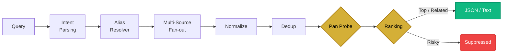

<p align="center">
  <a href="README.zh-CN.md">🇨🇳 简体中�?/a> | 🇺🇸 English
</p>

<div align="center">
  <h1>🎯 Quarry</h1>
  <p><em>Public resource routing engine purpose-built for AI Agents.</em></p>
  <p>Multi-source discovery �?intelligent ranking �?verified delivery.</p>
</div>

<p align="center">
  
  
  
  
  
</p>

---

## What is this?

Quarry is a **resource discovery engine** designed to be called by AI Agents (Hermes, OpenClaw, etc.).

It doesn't download files �?it **finds** the best public routes (cloud drive links, magnet URIs, ebook pages) across 24 sources, ranks them by quality, verifies liveness, and returns structured JSON.

```
User: "Find me Oppenheimer 4K resources"

Agent translates �?hunt.py search "Oppenheimer 2023" --4k --json

Engine returns:
  �?Top 1: Oppenheimer.2023.2160p.BluRay.REMUX �?aliyun link (verified alive)
  �?Top 2: Oppenheimer.2023.1080p.WEB-DL �?magnet (42 seeders)
  �?Suppressed: Oppenheimer.CAM.720p �?risky quality
```

---

## Features

### 🔍 Multi-Source Aggregation

28 source adapters across 3 channels:

| Channel | Sources | What they cover |
|:--------|:--------|:----------------|
| **Cloud Drive** | upyunso, pansou, ps.252035, panhunt | Aliyun, Quark, Baidu, 115, PikPak, Lanzou, etc. |
| **Torrent** | torznab, nyaa, dmhy, bangumi_moe, eztv, torrentgalaxy, bitsearch, tpb, yts, 1337x, limetorrents, torlock, fitgirl, torrentmac, ext_to | Movies, TV, anime, games, music, macOS apps |
| **Book** | annas (Anna's Archive), libgen (Library Genesis) | PDF, EPUB, MOBI, academic papers �?fiction & non-fiction |

### 📊 Intelligent Ranking

- **Title-family matching**: canonical, phrase, token overlap scoring
- **Quality parsing**: resolution, codec, HDR, source type, lossless audio
- **Category-aware**: different scoring weights for movie/TV/anime/music/software/book
- **Confidence tiers**: `top` �?`related` �?`risky` (suppressed by default)

### �?Pan Link Viability Probe

Cloud drive links die constantly. The engine auto-probes before delivery:

| Provider | Method | Result |
|:---------|:-------|:-------|
| Aliyun (AliDrive) | Anonymous share API | `alive` / `cancelled` |
| Quark (Quark Drive) | Share token API | `alive` / `expired` |
| Baidu (Baidu Netdisk) | Page dead-signal detection | `alive` / `removed` |

Dead links �?auto-demoted to `risky` tier, never shown in text output.

### 🛡�?Anti-Bot Layer (Optional)

```
Priority chain:  httpx �?curl_cffi �?urllib
```

Install `curl-cffi` to bypass DDoS-Guard and similar TLS fingerprint checks. Zero config �?auto-detected.

### 🎬 Video Pipeline

Public video URL �?metadata extraction �?optional download:

```bash
hunt.py video probe "https://www.bilibili.com/video/BV..."
hunt.py video download "https://youtu.be/..." best
```

### 📖 Subtitle Search

On-demand subtitle discovery (user-initiated, not automatic):

```bash
hunt.py subtitle "Breaking Bad" --season 1 --episode 1 --lang zh,en --json
```

Sources: SubDL (multilingual), SubHD (Chinese), Jimaku (Japanese anime).

---

## Quick Start

```bash
git clone https://github.com/mnbplus/quarry.git
cd quarry

# Zero dependencies for basic search
python3 scripts/hunt.py search "Oppenheimer 2023" --4k

# Optional performance extras
pip install httpx                    # HTTP/2 + connection pooling
pip install pycryptodome             # Upyunso encrypted API
pip install curl-cffi                # TLS fingerprint impersonation
```

### Search Examples

```bash
# Movies
python3 scripts/hunt.py search "Oppenheimer 2023" --4k --json

# TV Shows
python3 scripts/hunt.py search "Breaking Bad S05E16" --tv

# Anime
python3 scripts/hunt.py search "Kamiina Botan" --anime

# Music (lossless)
python3 scripts/hunt.py search "Jay Chou Fantasy FLAC" --music

# Software
python3 scripts/hunt.py search "Adobe Photoshop 2024" --software --channel pan

# Books
python3 scripts/hunt.py search "Clean Code epub" --book

# Skip pan link probing (faster, but may include dead links)
python3 scripts/hunt.py search "Interstellar 2014" --no-probe
```

### Diagnostics

```bash
python3 scripts/hunt.py sources --probe --json    # Source health check
python3 scripts/hunt.py doctor --json              # System diagnostics
python3 scripts/hunt.py benchmark                  # Offline precision benchmark
python3 scripts/hunt.py cache stats --json         # Cache statistics
```

### Updating

Updating is safe regardless of how you installed:

```bash
# Git users �?just pull
cd quarry && git pull

# ZIP users �?download new ZIP, extract over the old folder
# (or delete and re-extract, both work)
```

> **Auto-cleanup**: On first run after an update, the engine automatically detects and removes deprecated files from previous versions. No manual cleanup needed �?even if you extract a ZIP on top of an old installation.

### Customization

All user customizations go in the `local/` directory �?a **safe zone** that is never overwritten by updates:

```text
local/
├── sources/          # Drop custom SourceAdapter .py files here (auto-discovered)
├── config.json       # Override ranking weights
└── .env              # Override environment variables (takes priority over root .env)
```


### Optional: Token-Based Sources

25 of 28 sources work out of the box. 3 optional sources need credentials for extra coverage:

| Source | Env Variable | How to Get |
|:-------|:-------------|:-----------|
| **ps.252035 / panhunt** | `PANSOU_TOKEN` | Register at [linux.do](https://linux.do), login at [so.252035.xyz](https://so.252035.xyz), copy JWT from browser cookies |
| **pansou** (self-hosted) | `PANSOU_API_URL` | Deploy [fish2018/pansou](https://github.com/fish2018/pansou), set your instance URL |
| **torznab** (Jackett) | `TORZNAB_URL` + `TORZNAB_APIKEY` | Install [Jackett](https://github.com/Jackett/Jackett), copy API key from dashboard |

Add credentials to `.env` or `local/.env`:

```env
PANSOU_TOKEN=eyJhbGciOiJIUzI1NiIs...
TORZNAB_URL=http://localhost:9117/api/v2.0/indexers/all/results/torznab
TORZNAB_APIKEY=your-api-key
```

> See [`references/sources.md`](./references/sources.md#how-to-obtain-tokens) for detailed step-by-step instructions.
> Custom source adapters, ranking tweaks, and env variables in `local/` are **update-proof** �?`git pull` and ZIP updates both leave this directory untouched.

---

## Agent Integration

Quarry is designed as an **AI Agent skill** �?it's meant to be called by Agents, not used directly by humans.

### For Hermes / OpenClaw

Agent config files are in `agents/`:

```yaml
# agents/hermes.yaml �?Agent instructions include:
# - Query translation workflow (CJK �?English)
# - Category-specific routing guidance
# - Result interpretation (link_alive, tiers, penalties)
# - Available command reference
```

### Skill Definition

[`SKILL.md`](./SKILL.md) is the Agent-readable skill contract:

- **When to use**: public resource discovery, release comparison, video probing
- **Query normalization**: Agent MUST translate to English before searching
- **Result interpretation**: how to read `link_alive`, `tier`, `penalties`
- **Category routing**: which sources fire first for each content type
- **13 agent rules**: ordering, fallback behavior, format hints

### JSON v3 Output

```bash
python3 scripts/hunt.py search "Oppenheimer 2023" --json
```

```json
{
  "schema_version": "3",
  "query": "Oppenheimer 2023",
  "results": [
    {
      "tier": "top",
      "title": "Oppenheimer.2023.2160p.BluRay.REMUX.HEVC.DTS-HD",
      "link_or_magnet": "https://alipan.com/s/...",
      "provider": "aliyun",
      "source": "upyunso",
      "source_health": {
        "link_alive": true,
        "link_probe_reason": "share active"
      },
      "quality": "2160p BluRay REMUX HDR",
      "confidence": 0.95,
      "match_bucket": "exact_title_family",
      "canonical_identity": "movie:oppenheimer:2023"
    }
  ]
}
```

Key fields for Agents:

| Field | Meaning |
|:------|:--------|
| `tier` | `top` = high confidence, `related` = decent, `risky` = unreliable |
| `source_health.link_alive` | `true` = verified, `false` = dead (skip it), `null` = unknown |
| `confidence` | 0.0 �?1.0 match confidence score |
| `match_bucket` | `exact_title_family`, `title_family_match`, `weak_context_match`, etc. |
| `canonical_identity` | Deduplication key (e.g. `movie:oppenheimer:2023`) |

---

## Architecture



### Routing Matrix

| Category | Primary �?Fallback | Key Signal |
|:---------|:-------------------|:-----------|
| Movie | Pan �?YTS/TorrentGalaxy/TPB �?1337x | Year match |
| TV | EZTV/TorrentGalaxy/TPB �?Pan | S{XX}E{XX} |
| Anime | Nyaa/DMHY/Bangumi Moe �?Pan | Romanized title |
| Book | **Anna's Archive** �?Pan �?1337x/TorLock | Format (pdf/epub) |
| Music | Pan �?DMHY/Nyaa (noise-filtered) | Lossless tags |
| Software | Pan �?FitGirl/TorrentMac/TorrentGalaxy | Platform hint |

---

## Project Layout

```text
quarry/
├── scripts/
�?  ├── hunt.py                    # CLI entrypoint
�?  └── quarry/
�?      ├── engine.py              # Search orchestration
�?      ├── intent.py              # Query �?Intent �?SearchPlan
�?      ├── ranking.py             # Scoring, tiers, deduplication
�?      ├── pan_probe.py           # Cloud drive link viability probe
�?      ├── parsers.py             # Release tag parsing (resolution, codec, HDR)
�?      ├── config.py              # RankingConfig weights
�?      ├── cache.py               # SQLite WAL cache
�?      ├── video_core.py          # Public video pipeline (yt-dlp)
�?      ├── subdl.py / subhd.py / jimaku.py   # Subtitle sources
�?      └── sources/               # 28 source adapters
�?          ├── base.py            # HTTPClient (httpx �?curl_cffi �?urllib)
�?          ├── upyunso.py         # Cloud drive aggregator (AES encrypted API)
�?          ├── pansou.py          # PanSou self-hosted pan aggregation API
�?          ├── nyaa.py            # Anime torrents (RSS)
�?          ├── dmhy.py            # 動漫花園 Chinese anime community (RSS)
�?          ├── bangumi_moe.py     # Bangumi Moe anime torrents (JSON API)
�?          ├── torrentgalaxy.py   # TorrentGalaxy general tracker (RARBG alt)
�?          ├── torlock.py         # TorLock verified torrents
�?          ├── ext_to.py          # EXT.to modern magnet search
�?          ├── annas.py           # Anna's Archive books (HTML scraper)
�?          ├── torznab.py         # Jackett/Prowlarr meta-indexer
�?          └── ...                # eztv, bitsearch, tpb, yts, 1337x, etc.
├── agents/
�?  ├── hermes.yaml                # Hermes Agent skill config
�?  └── openclaw.yaml              # OpenClaw Agent skill config
├── local/                         # 🛡�?User safe zone (gitignored contents)
�?  ├── sources/                   # Custom source adapters (auto-discovered)
�?  ├── config.json                # Ranking weight overrides
�?  └── .env                       # Environment variable overrides
├── tests/                         # 22 unit + precision + benchmark tests
├── references/                    # Architecture, usage, source docs
├── SKILL.md                       # Agent-readable skill contract
├── CHANGELOG.md
└── pyproject.toml
```

---

## Scope

| �?What this does | �?What this doesn't do |
|:---|:---|
| Find public download routes | Download files |
| Rank results by quality | Bypass DRM or logins |
| Verify cloud drive link liveness | Access private trackers |
| Provide structured JSON for Agents | Guarantee legality or permanence |

---

## Requirements

| Component | Dependency | Required? |
|:----------|:-----------|:----------|
| Core search | Python 3.10+ | Yes |
| HTTP acceleration | `httpx` | Optional |
| TLS impersonation | `curl-cffi` | Optional |
| Upyunso API | `pycryptodome` | Optional |
| Video pipeline | `yt-dlp` + `ffmpeg` | Optional |

---

## Contributing

> **AI coding agents**: Read [`CONTRIBUTING.md`](./CONTRIBUTING.md) before making any changes.  
> User customizations go in `local/`, not in `scripts/`.

```bash
# Run benchmark before PR
python3 scripts/hunt.py benchmark

# Run tests
python -m pytest tests/ -v
```

## License

[MIT-0](./LICENSE) �?no attribution required.

## Feedback and Issues

If you encounter any bugs, have feature requests, or need help with custom source adapters, please [open an issue](https://github.com/mnbplus/quarry/issues/new) on GitHub. Pull requests are also highly welcome!
