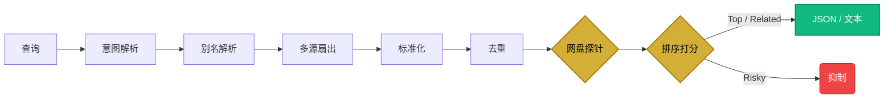

<p align="center">
  🇨🇳 简体中文 | <a href="README.md">🇺🇸 English</a>
</p>

<div align="center">
  <h1>🎯 Quarry</h1>
  <p><em>为 AI Agent 打造的公共资源路由引擎。</em></p>
  <p>多源发现 → 智能排序 → 验证交付。</p>
</div>

<p align="center">
  
  
  
  
  
</p>

---

## 这是什么？

Quarry 是一个**资源发现引擎**，设计用于被 AI Agent（Hermes、OpenClaw 等）调用。

它不负责下载——它**搜索**最佳公共路由（网盘链接、磁力 URI、电子书页面），跨 28 个源进行排序、验证存活性，返回结构化 JSON。

```
用户："帮我找 Oppenheimer 4K 资源"

Agent 翻译 → hunt.py search "Oppenheimer 2023" --4k --json

引擎返回：
  ✅ Top 1: Oppenheimer.2023.2160p.BluRay.REMUX — 阿里云盘链接（已验证存活）
  ✅ Top 2: Oppenheimer.2023.1080p.WEB-DL — 磁力链接（42 做种）
  ❌ 抑制: Oppenheimer.CAM.720p — 质量不可靠
```

---

## 核心功能

### 🔍 多源聚合

28 个源适配器，覆盖 3 个通道：

| 通道 | 源 | 覆盖范围 |
|:-----|:---|:---------|
| **网盘** | upyunso, pansou, ps.252035, panhunt | 阿里云盘、夸克、百度网盘、115、PikPak、蓝奏等 |
| **种子** | torznab, nyaa, dmhy, bangumi_moe, eztv, torrentgalaxy, bitsearch, tpb, yts, 1337x, limetorrents, torlock, fitgirl, torrentmac, ext_to, subsplease, knaben, btdig, solidtorrents, torrentcsv, glodls, idope | 电影、剧集、动漫、游戏、音乐、macOS 应用、DHT 网络 |
| **电子书** | annas (Anna's Archive), libgen (Library Genesis) | PDF、EPUB、MOBI — 文学、非文学、学术论文 |

### 📊 智能排序

- **标题族匹配**：精确匹配、短语匹配、Token 重叠评分
- **质量解析**：分辨率、编码器、HDR、源类型、无损音频
- **分类感知**：电影/剧集/动漫/音乐/软件/电子书各有不同权重
- **置信度分层**：`top` → `related` → `risky`（默认抑制显示）

### ✅ 网盘链接存活探针

网盘分享链接经常失效。引擎自动探测后再交付：

| 网盘 | 探测方式 | 判定结果 |
|:-----|:---------|:---------|
| 阿里云盘 | 匿名分享 API | `存活` / `已取消` |
| 夸克网盘 | 分享令牌 API | `存活` / `已过期` |
| 百度网盘 | 页面死亡信号检测 | `存活` / `已删除` |

死链 → 自动降级为 `risky`，文本输出中不会显示。

### 🛡️ 反爬层（可选）

```
优先级链：httpx → curl_cffi → urllib
```

安装 `curl-cffi` 可绕过 DDoS-Guard 等 TLS 指纹检测。零配置——自动检测。

### 🎬 视频流水线

公共视频 URL → 元数据提取 → 可选下载：

```bash
hunt.py video probe "https://www.bilibili.com/video/BV..."
hunt.py video download "https://youtu.be/..." best
```

### 📖 字幕搜索

按需字幕发现（用户主动发起，非自动挂载）：

```bash
hunt.py subtitle "Breaking Bad" --season 1 --episode 1 --lang zh,en --json
```

来源：SubDL（多语言）、SubHD（中文）、Jimaku（日本动漫）。

---

## 快速开始

```bash
git clone https://github.com/mnbplus/quarry.git
cd quarry

# 基础搜索无需任何依赖
python3 scripts/hunt.py search "Oppenheimer 2023" --4k

# 可选性能增强
pip install httpx                    # HTTP/2 + 连接池
pip install pycryptodome             # Upyunso 加密 API
pip install curl-cffi                # TLS 指纹伪装
```

### 搜索示例

```bash
# 电影
python3 scripts/hunt.py search "Oppenheimer 2023" --4k --json

# 剧集
python3 scripts/hunt.py search "Breaking Bad S05E16" --tv

# 动漫
python3 scripts/hunt.py search "Kamiina Botan" --anime

# 音乐（无损）
python3 scripts/hunt.py search "周杰伦 范特西 FLAC" --music

# 软件
python3 scripts/hunt.py search "Adobe Photoshop 2024" --software --channel pan

# 电子书
python3 scripts/hunt.py search "Clean Code epub" --book

# 跳过网盘链接探测（更快，但可能包含失效链接）
python3 scripts/hunt.py search "Interstellar 2014" --no-probe
```

### 诊断工具

```bash
python3 scripts/hunt.py sources --probe --json    # 源健康检查
python3 scripts/hunt.py doctor --json              # 系统诊断
python3 scripts/hunt.py benchmark                  # 离线精度基准
python3 scripts/hunt.py cache stats --json         # 缓存统计
```

### 如何更新

无论你以何种方式安装，更新都是安全的：

```bash
# Git 用户 — 直接 pull
cd quarry && git pull

# ZIP 用户 — 下载新 ZIP，直接解压覆盖旧文件夹
# （或者先删除再解压，两种方式都可以）
```

> **自动清理**：更新后首次运行时，引擎会自动检测并删除旧版本中已废弃的文件。无需手动清理 — 即使你直接在旧安装上覆盖解压 ZIP 也完全没问题。

### 自定义配置

所有用户自定义内容都放在 `local/` 目录中 — 这是一个永远不会被更新覆盖的**安全区**：

```text
local/
├── sources/          # 放入自定义 SourceAdapter .py 文件（自动发现加载）
├── config.json       # 覆盖排序权重
└── .env              # 覆盖环境变量（优先级高于根目录 .env）
```

> `local/` 中的自定义源适配器、排序调整和环境变量都是**更新安全的** — `git pull` 和 ZIP 更新都不会触碰这个目录。

---

## Agent 集成

Quarry 是一个 **AI Agent 技能**——设计目标是被 Agent 调用，而非人工直接使用。

### Hermes / OpenClaw 配置

Agent 配置文件在 `agents/` 目录下：

```yaml
# agents/hermes.yaml — Agent 指令包含：
# - 查询翻译工作流（中日韩 → 英文）
# - 分类路由引导
# - 结果解读（link_alive、tier、penalties）
# - 可用命令参考
```

### 技能定义

[`SKILL.md`](./SKILL.md) 是 Agent 可读的技能契约：

- **何时使用**：公共资源发现、版本比较、视频探测
- **查询规范化**：Agent 必须先翻译成英文再搜索
- **结果解读**：如何读取 `link_alive`、`tier`、`penalties`
- **分类路由**：每种内容类型优先使用哪些源
- **13 条 Agent 规则**：排序、回退、格式提示

### JSON v3 输出

```json
{
  "schema_version": "3",
  "results": [
    {
      "tier": "top",
      "title": "Oppenheimer.2023.2160p.BluRay.REMUX",
      "provider": "aliyun",
      "source_health": { "link_alive": true },
      "confidence": 0.95,
      "canonical_identity": "movie:oppenheimer:2023"
    }
  ]
}
```

Agent 关键字段：

| 字段 | 含义 |
|:-----|:-----|
| `tier` | `top` = 高置信度, `related` = 尚可, `risky` = 不可靠 |
| `source_health.link_alive` | `true` = 已验证, `false` = 已失效（跳过）, `null` = 未知 |
| `confidence` | 0.0 – 1.0 匹配置信度 |
| `canonical_identity` | 去重标识（如 `movie:oppenheimer:2023`） |

---

## 架构



### 路由矩阵

| 分类 | 主力 → 备选 | 关键信号 |
|:-----|:------------|:---------|
| 电影 | 网盘 → YTS/TorrentGalaxy/TPB → 1337x → TorrentCSV/GLODLS/iDope | 年份匹配 |
| 剧集 | EZTV/TorrentGalaxy/TPB → 网盘 → TorrentCSV/GLODLS/iDope | S{XX}E{XX} |
| 动漫 | Nyaa/DMHY/Bangumi Moe → 网盘 → TorrentCSV/iDope | 罗马音标题 |
| 电子书 | **Anna's Archive** → **Libgen** → 网盘 → 1337x/TorLock | 格式（pdf/epub） |
| 音乐 | 网盘 → DMHY/Nyaa（过滤噪声）→ TorrentCSV/iDope | 无损标签 |
| 软件 | 网盘 → FitGirl/TorrentMac/TorrentGalaxy → GLODLS/iDope | 平台提示 |

---

## 项目结构

```text
quarry/
├── scripts/
│   ├── hunt.py                    # CLI 入口
│   └── quarry/
│       ├── engine.py              # 搜索编排
│       ├── intent.py              # 查询 → 意图 → 搜索计划
│       ├── ranking.py             # 打分、分层、去重
│       ├── pan_probe.py           # 网盘链接存活探针
│       ├── parsers.py             # 发布标签解析（分辨率、编码、HDR）
│       ├── video_core.py          # 公共视频流水线（yt-dlp）
│       ├── subdl.py / subhd.py / jimaku.py   # 字幕源
│       └── sources/               # 24 个源适配器
│           ├── base.py            # HTTPClient（httpx → curl_cffi → urllib）
│           ├── upyunso.py         # 网盘聚合器（AES 加密 API）
│           ├── pansou.py          # PanSou 自建网盘聚合 API
│           ├── nyaa.py            # 动漫种子（RSS）
│           ├── dmhy.py            # 動漫花園 中文动漫社区（RSS）
│           ├── bangumi_moe.py     # Bangumi Moe 动漫种子（JSON API）
│           ├── torrentgalaxy.py   # TorrentGalaxy 综合 Tracker（RARBG 替代）
│           ├── torlock.py         # TorLock 已验证种子
│           ├── ext_to.py          # EXT.to 现代磁力搜索
│           ├── annas.py           # Anna's Archive 电子书（HTML 爬虫）
│           ├── libgen.py          # Library Genesis 电子书/论文（HTML 爬虫，多镜像）
│           ├── torrentcsv.py      # TorrentCSV DHT 种子（JSON API）
│           ├── glodls.py          # GLODLS 综合种子索引（HTML 爬虫）
│           ├── idope.py           # iDope DHT 种子搜索（HTML 爬虫）
│           └── ...                # eztv, bitsearch, tpb, yts, 1337x 等
├── agents/
│   ├── hermes.yaml                # Hermes Agent 技能配置
│   └── openclaw.yaml              # OpenClaw Agent 技能配置
├── tests/                         # 22 个单元 + 精度 + 基准测试
├── references/                    # 架构、使用、源文档
├── SKILL.md                       # Agent 可读技能契约
└── pyproject.toml
```

---

## 职责边界

| ✅ 做什么 | ❌ 不做什么 |
|:---------|:-----------|
| 搜索公共下载路由 | 下载文件 |
| 按质量排序结果 | 绕过 DRM 或登录 |
| 验证网盘链接存活 | 接入私有 Tracker |
| 为 Agent 提供结构化 JSON | 保证合法性或永久性 |

---

## 依赖

| 组件 | 依赖 | 必需？ |
|:-----|:-----|:------|
| 核心搜索 | Python 3.10+ | 是 |
| HTTP 加速 | `httpx` | 可选 |
| TLS 伪装 | `curl-cffi` | 可选 |
| Upyunso API | `pycryptodome` | 可选 |
| 视频流水线 | `yt-dlp` + `ffmpeg` | 可选 |

---

## 许可

[MIT-0](./LICENSE) — 无需署名。

## 反馈与交流

如果你在使用过程中遇到任何 Bug，有新的功能需求（例如添加新的网盘或磁力源），或者对自定义适配器有任何疑问，非常欢迎你在 GitHub 提交 [Issue](https://github.com/mnbplus/quarry/issues/new) 与我们交流。同时也强烈欢迎提交 PR！
